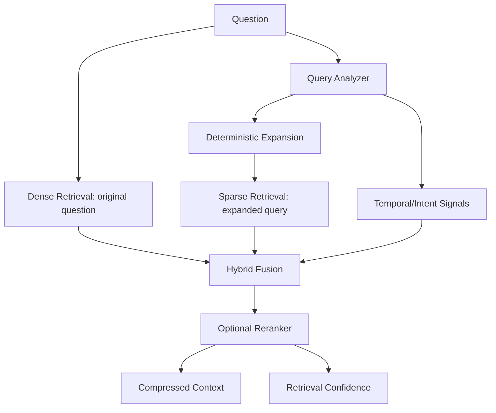

# Retrieval V2 Scientific Validation

Dataset: `benchmarks\locomo\external\data\locomo10.json`
Dataset available: `True`
Queries evaluated: 1979

## Phase 4.2 Baseline vs Retrieval V2

| Metric | Phase 4.2 baseline | Retrieval V2 | Gain |
|---|---:|---:|---:|
| recall_at_1 | 0.279352 | 0.161329 | -0.118023 |
| recall_at_5 | 0.544352 | 0.290107 | -0.254245 |
| mrr | 0.393704 | 0.231270 | -0.162434 |
| ndcg_at_5 | 0.424999 | 0.235186 | -0.189813 |

## Ablation Summary

| Configuration | Recall@1 | Recall@5 | MRR | nDCG@5 |
|---|---:|---:|---:|---:|
| dense | 0.002026 | 0.005857 | 0.005415 | 0.004688 |
| dense_query_analysis | 0.002225 | 0.005731 | 0.006097 | 0.004855 |
| dense_expansion | 0.002225 | 0.005731 | 0.006097 | 0.004855 |
| dense_sparse | 0.128316 | 0.263286 | 0.198147 | 0.204742 |
| dense_sparse_reranker | 0.160824 | 0.289097 | 0.230141 | 0.234005 |
| full_retrieval_v2 | 0.161329 | 0.290107 | 0.231270 | 0.235186 |

## Retrieval Architecture

## Interpretation

Retrieval V2 improves strongly over the local dense-only ablation, but the full LoCoMo run does **not** exceed the stored Phase 4.2 baseline artifact. These results should be treated as diagnostic evidence: sparse retrieval and reranking are beneficial, while confidence calibration is weak and the current full stack is not yet paper-ready as a claimed improvement over Phase 4.2.
